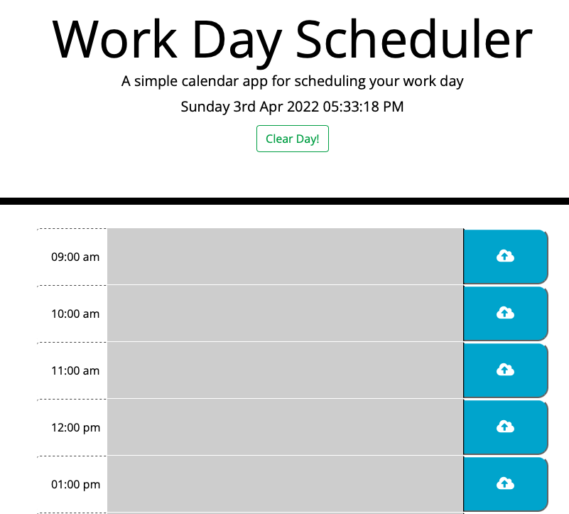

# Manifesta-Work-Day-Scheduler
This is a calnedar application that allows to capture events for each hour of the day. Time blockes are color coded indication past, present and futere events. 

## Website:

## Github:

